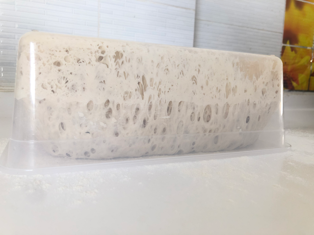
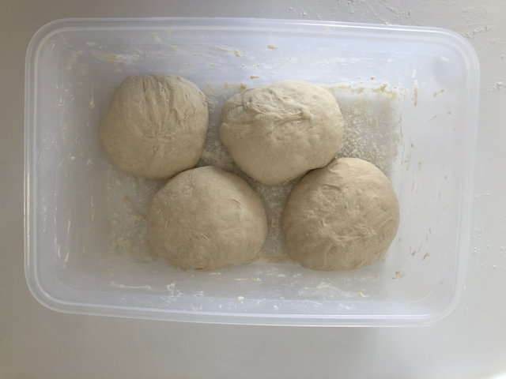
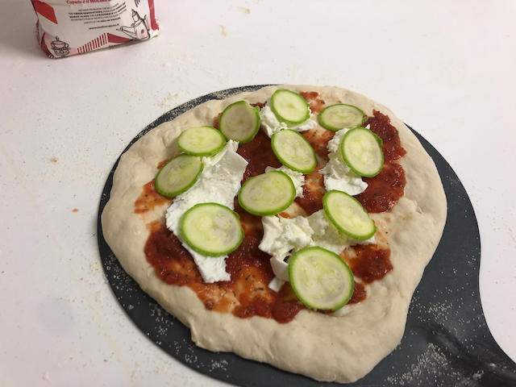

# בצק פיצה ללא לישה

## מקור

הרבה מהדברים שמכין אלכס, הבחור הצרפתי שמבשל, אני לא אכין. חלקם כי מסובך מידי, חלקם כי אני לא אוכל את זה וחלקם כי יש לי מתכון אחר.
במקרה הזה, המתכון של הפיצה היה פשוט מידי מכדי לא לנסות, במיוחד כשיש לי מספיק זמן לתת לבצק לעשות את העבודה שלו.

זה מתכון לבצק ב־70% הידרציה, זאת אומרת מים בכמות של 70% מהבצק.
אלכס מסביר שבאפיה ביתית צריך הידרציה גבוה כי הפיצה בתנור 6-7 דקות בניגוד לפיצריות בהן הפיצה הרבה פחות זמן וכדאי שהבצק לא יתייבש בתנור שלנו.

## מתכון

- 430 גרם מים
- 1.6 גרם שמרים טריים או כחצי גרם שמרים יבשים (אני מודה, שמתי גרם שמרים יבשים, בערך)
- 200 גרם קמח טיפו 00
- 20 גרם מלח
- 430 גרם קמח טיפו 00 (כן, עוד קמח)

## הוראות

בכלי פלסטיק לא קטן שמים את המים.
מוסיפים להם את השמרים וממוססים את השמרים.
מפזרים 200 גרם קמח, שיגן על השמרים מהמלח שתכף נוסיף.
כן, עכשיו נוסיף את המלח ונערבב היטב.
ונוסיף את שאר הקמח ונערבב כדי לא להשאיר קמח יבש.
עכשיו החלק הכי קל - סוגרים את כלי הפלסטיק ל־12 עד 18 שעות בטמפרטורת החדר.

בערך שעתיים לפני שרוצים להתחיל לאפות אלכס מציע להפוך את הכלי על משטח מקומח ולתת לבצק ליפול אליו בעצמו.
אחרי בערך דקה אוספים את הבצק ומחלקים אותו לכדורים (אלכס מחלק ל־7, אני חילקתי ל־4) ושמים שוב בקופסה לשעתיים.

## תמונות

